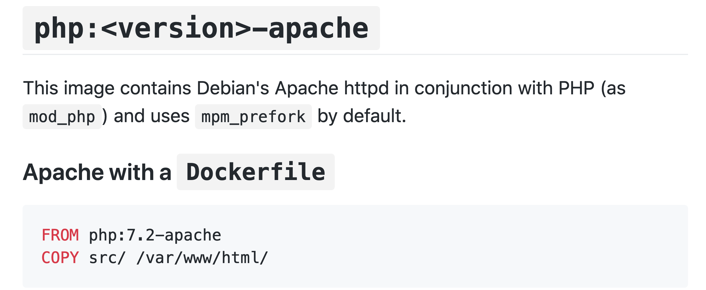

## Build a slightly more interesting container
Let's move on to something a little bit more interesting, by creating a container running a web server!

First, lets go back a step and create a new directory that we will work in.

&nbsp;&nbsp;&nbsp;&nbsp;&nbsp;&nbsp; `cd ..`{{execute}}
&nbsp;&nbsp;&nbsp;&nbsp;&nbsp;&nbsp; `mkdir step6`{{execute}}
&nbsp;&nbsp;&nbsp;&nbsp;&nbsp;&nbsp; `cd step6`{{execute}}

So, now let's create the application we want our server to run. For simpicity's sake, we will keep it simple and just print a message of your choosing. For reasons that will be explained later, we need to create a directory called `/src`, so let's do so by calling:

&nbsp;&nbsp;&nbsp;&nbsp;&nbsp;&nbsp; `mkdir src`{{execute}}
&nbsp;&nbsp;&nbsp;&nbsp;&nbsp;&nbsp; `cd src`{{execute}}


We will write our basic program in php:
```php
<?php
echo "Some message";
```

Recall how this was done in the previous step:  

&nbsp;&nbsp;&nbsp;&nbsp;&nbsp;&nbsp; `vim index.php`{{execute}}

Enter insert mode by pressing `i`{{execute}}, and write

&nbsp;&nbsp;&nbsp;&nbsp;&nbsp;&nbsp; `<?php`{{execute}}
&nbsp;&nbsp;&nbsp;&nbsp;&nbsp;&nbsp; `echo "Some message"`{{execute}}

Then press `esc`, followed by `:wq`{{execute}} to leave and save the file.

Next we want to create the Dockerfile for our new contianer. First we need to leave the `src` directory, since the Dockerfile should be created outside of it. Call:

&nbsp;&nbsp;&nbsp;&nbsp;&nbsp;&nbsp; `cd ..`{{execute}})

The Dockerfile should look like this, and can be created just as the php file was:
```
FROM php:<version>-apache
COPY src/ /var/www/html/
EXPOSE 80
```

So, before you just copy and paste this, let's take a closer look at each of the lines, and understand why they are as they are. So, as we know, we need a base layer to build upon for our new image, and we want our container to function as a web server for an application written in `php`. Lucky for us, a perfect image to build from is accesible on the docker hub! So let's visit `https://hub.docker.com/`, and search for `php`. What we will find is that there is an official `php` [image](https://hub.docker.com/_/php). Now this page contain documention for how the image should be used, as well as some different variants of the image itself, each designed for different purposes. Since we would like to create a web server, we will go with the `apache` variant! By scrolling down a bit on the page, instructions for how this image should be used can be found (the `php:<version>-apache` header):



These instructions cover the 2 first lines of our Dockerfile. The first line specifies that we want the `php` image, version `<version>-apache`, as a base layer. Do note that the user needs to specify a version for `php`. To choose version, we should visit the `Supported tags and respective Dockerfile links` section on top of the page. Usually, this section allows us to see all version identifiers of a docker image (The version identifier of a docker image is called a `tag`, and as we can see an image can have multiple versions), but due to its size, we are instead redirected [elsewhere](https://github.com/docker-library/docs/blob/master/php/README.md#supported-tags-and-respective-dockerfile-links). On this page, we can see that the latest version of the php image is 7.4 (at least during the writing of this tutorial, time is likely to change this, as evident by the use of 7.2 in the docker hub documentation, even though a later version is available!).

The second line copies the local `src` directory in to the container at the container path `/var/www/html/`, which is the reason we named the directory `src` above.


The `EXPOSE` keyword makes the container listen to a specific port, in our case port 80.

Now, let's continue following the intructions from the docker hub documentation for the php image (the `php:<version>-apache` header). To build our image, simply call:

&nbsp;&nbsp;&nbsp;&nbsp;&nbsp;&nbsp; `docker build -t my-php-app .`{{execute}}

Remember, `-t` is the flag that allows us to name our image.

And now, there is only one real step left, to run our new container. But first, how do we see that everything is working as expected? This tutorial is written for Katacoda, and Katacoda offers a simple soultion for this problem. If you press the `Dashboard`-button on top of the page, you will be able to connect to a specific port. Port 80 should already be selected, but make sure that it actually is! So, now we can run the container:

&nbsp;&nbsp;&nbsp;&nbsp;&nbsp;&nbsp; `docker run -d --name my-running-app -p 80:80 my-php-app`{{execute}}

The `-d` flag allows the container to run in detached mode, i.e. the container will run in the background, while the `-p` flag forwards port 80 of the host to the exposed port 80 in the container.

Let's take a look at our running containers, and make sure that our container is active:
&nbsp;&nbsp;&nbsp;&nbsp;&nbsp;&nbsp; `docker ps`{{exectute}}

If you followed the steps correctly, you should see your container listed as running, and if you once again press the `Dashboard` button, your message should be visible!

-------------------------------
