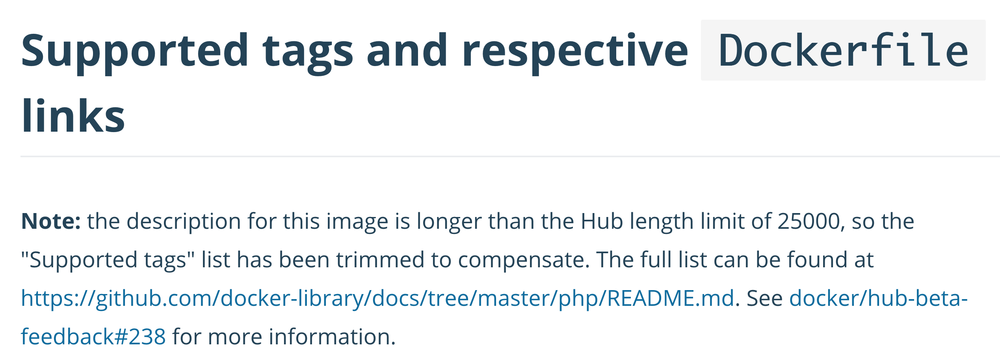
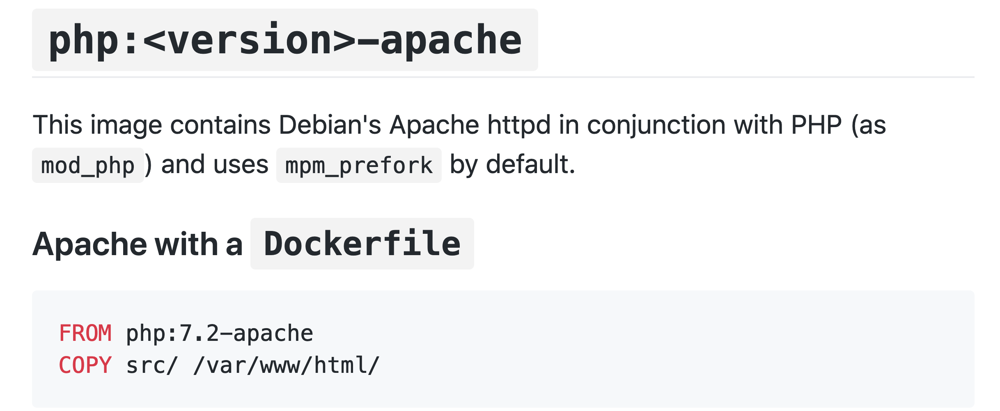

## build a more interesting container
<!-- That listen to port 80 -->

<!--
TODO may need to mention how to remove an image
you can remove an image through calling: docker rmi Image my-first-image:latest
-->

So now after we learned how to build a simple container, let's build something that is more interesting. Let's create another simple hello world application but this time in PHP that can also listen to port 80.

<!--
TODO Important: First, we need to create a folder called src and to do some other staff
-->
Let's go back to the root folder `cd ..`{{execute}}. Then,
- create a folder, E.g. `mkdir myPHP`{{execute}}.
- navigate to it `cd myPHP`{{execute}},
- create another folder inside `myPHP`, called `src`, `mkdir src`{{execute}} (This will make things easier to us later).
- navigate to it `cd src`{{execute}}
- create a file called index.php `touch index.php`{{execute}}.
- You can edit the file using vim, `vim index.php`{{execute}} and then write:
  - `<? php`{{execute}},
  - `<? echo "Hello from the index file";`{{execute}}, or any other message.

Let's create the `Dockerfile`:
- Go back to the `myPHP` folder `cd ..`{{execute}}.
- create a Dockerfile, `touch Dockerfile`{{execute}},

Now Let's edit it
- call `vim Dockerfile`{{execute}}
- type `i`{{execute}} to enter the insert mode
- then type `FROM php:7.4-apache`{{execute}}
- and `COPY src/ /var/www/html/`{{execute}}
- and `EXPOSE 80`{{execute}}
- Finally type `esc` and then `:wq`{{execute}}

What do that mean?
We want an operating system that has PHP and Apache (a web server software) installed. So instead of starting from the scratch, we can search in docker hub about an image that has already all these things installed on it.

if you visit [docker hub](https://hub.docker.com/) and searched for a PHP image, Choose the [official one](https://hub.docker.com/_/php) (the official images are usually better than the unofficial ones).

In this page we can find many section. One of them called
`Supported tags and respective Dockerfile links` (it is almost the first section). From there we can choose all version identifiers of this docker image. The version identifier of a docker image called a `tag`. One can have multiple versions for the same image.

However, since this image is quite famous and there are always new variations and versions, the list of all the supported tags exceed the limit of the of the Hub length, thus hub page tells us to visit  [this github link](https://github.com/docker-library/docs/blob/master/php/README.md#supported-tags-and-respective-dockerfile-links) instead, as the image below, where we can see the whole list of the tags existed for this image.

Find the one that has the **newer version of PHP** and **Apache**. You don't need to click on it, we just need to know the name of this tag, here I choose `7.4-apache`.

<!--
TODO DO I need to explain what the user will see if he clicked on it, It will actually show him what operating system this image is based on and how all images are build on each others
-->

If you scroll down in the Github page or in docker hub, you will find under the section called `Image Variants` another section called `php:<version>-apache` that explain to you how to use the `apache` with docker and what should we wrote in the Dockerfile, as the image below show:

There you can see that two command lines written there are almost the same as what we wrote previously in our Dockerfile.
There we have just defined that our base image will be the one called `php`. After the `:` we will write the tag we choose `7.4-apache`. We have just change the version of PHP to a newer version.

In the next line we just want to `copy` our files that we wrote (in the src) to the image (or a specific place inside the image `/var/www/html` which is the default `DocumentRoot` in Apache as Github also explain in another section).
<!--
TODO Should I explain that this may be faster and easier than creating the files in the image directly
TODO and do I need to mention "and from there we can also see how calling the folder we created from beginning for `src` will make things easier to us".
-->
To do this we has basically used the `COPY` keyword.

The last line in our Dockerfile `EXPOSE 80` is to expose port 80. The keyword `EXPOSE` means when you build the image and create a container of it, this container will basically listen to port 80.

Now after we understand all the lines in the Dockerfile, let's build this image and see if it work as expected.
Call: `docker build -t my-php .`{{execute}}

<!--
TODO to run and move the container to somewhere else:
docker run -it --name my-linux --rm -v /root/nourTest/:/my-data ubuntu bash
-->

//-------------------------------
