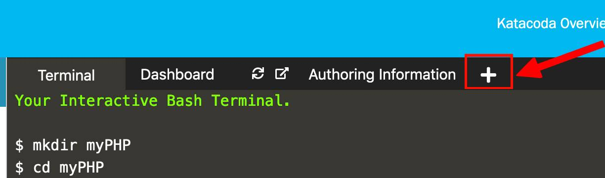

## Listen and see the changes directly

<!--
TODO Another good site that explain how to remove images:
https://linuxize.com/post/how-to-remove-docker-images-containers-volumes-and-networks/#remove-one-or-more-images

docker image rm imageID
-->

Great! We can now run an apache server through docker. That is amazing. However we can still making this thing even more interesting and amazing.

Open another terminal in Katacoda, you can do this through clicking the plus sign next to Dashboard as the image below:

Then choose `Open New Terminal`

In this new terminal called `Terminal 2` change the `index.php` file.

- Call `vim myPHP/src/index.php`{{execute T2}}
- type `i`{{execute T2}} to enter the insert mode
- Change the text that we echoed to any thing else, E.g. `Hello 2, from same index file` (Don't change anything else, keep the other commands as they were).
- Finally type `esc` and then `:wq`{{execute}}

Now if you go to the Dashboard again and clicked the refresh button, nothing will change. You need basically to click `^C` in the Terminal 1 to stop container and exit it. and then rebuild the image and recreate a container.

Imagine that you want to write a whole php and apache project. It will be very boring to do so every time you change something in the in the `index.php` or in the `src` folder, Especially if you are debugging and trying to find some errors.

There is a nice very easy solution to this issue that make your changes appear as if it synchronising with docker container that is run.

basically go back to `Terminal 1` (called only in the `Terminal` in Katacoda) and stop the running container using `^c`{{execute T1}} or ( `control + c` if you are using Windows).

<!--TODO
not sure what is the command to stop a process in Windows

TODO And the excute command doesn't work for `^c`
-->

Then instead for running the container using the `run` command used in  step 6: `docker run -p 80:80 my-php`, call this instead:
`docker run -p 80:80 -v /root/myPHP/src/:/var/www/html/  my-php`{{execute T1}}.

Now if you refreshed the Dashboard, you will obviously see the last change we have done to the index file. Furthermore, if you go again to the `Terminal 2`, and changes the `index.php` file to echo `Helloooo 3, from saammme index file` using the previous mentioned steps:

- Call `vim myPHP/src/index.php`{{execute T2}}
- type `i`{{execute T2}} to enter the insert mode
- Change the text that we echoed to any thing else, E.g. `Helloooo 3, from saammme index file` (Don't change anything else, keep the other commands as they were).
- Finally type `esc` and then `:wq`{{execute}}

You will see the same text appear to you in the Dashboard if you refresh it and without stopping the running process in the first terminal.

#### Why do that happened?

In order to understand what happened, we need to have an overview of how the Docker manage and store data.
All the file that are created inside a container are by default not persistent. That means all the files will be deleted when the container removed or no longer existed.  

Docker has 2 main options that can help containers to store files in the host machine and make the files created inside a container persistent. These 2 options can basically created a shared storage between both the container and the host machine.

The first option called `volume` and the second option called `bind mount` (and it is the one we used in the previous command).
Actually there is also a third option called `tmpfs mount` but it doesn't work on all systems so We are going to ignore it in this tutorial.

The following image can help us illustrating the difference between the 2 options:

#### difference between `volume` and `bind mount`

- `volumes`: are stored in a specific place inside the host system (E.g. in linux it is usually `/var/lib/docker/volumes`) that is managed by the Docker itself. The other processes (that are non-Docker) shouldn't edit this folder (or filesystem).
<!-- TODO
Do I need to mention this: "volumes are managed by Docker and are isolated from the core functionality of the host machine."
The complete sentenece was copied from the documentation https://docs.docker.com/storage:
When you create a volume, it is stored within a directory on the Docker host. When you mount the volume into a container, this directory is what is mounted into the container. This is similar to the way that bind mounts work, except that volumes are managed by Docker and are isolated from the core functionality of the host machine. -->
You can manually create a volume or Docker can itself create one during the creating process of the container.

- `bind mounts`: mount a file or a folder to the container using the full path. That means the files/folder can be anywhere in your system and it doesn't need to be in the Docker host before. However, you should be little careful since bind mount since that you actually can change the host filesystem via processes running in the container (creating changing or deleting important system files or directories).

In general `volumes` have more functionality than `bind mounts`.
E.g. A volume can be used to mount multiple containers with each others simultaneously.
<!-- TODO
The complete sentence from the documentation:

A given volume can be mounted into multiple containers simultaneously. When no running container is using a volume, the volume is still available to Docker and is not removed automatically. You can remove unused volumes using docker volume prune.
-->

For more information about that you can check the [documentation](https://docs.docker.com/storage/)

#### The `-v` flag
Back to the command we wrote:
`docker run -p 80:80 -v /root/myPHP/src/:/var/www/html/  my-php`

I have mentioned that here we are using `bind mount` to mount a folder in our file system (in our host machine) which is in our case: `/root/myPHP/src`. This file will be now shared between the container and our host machine. The second path written in the command (`/var/www/html/`) is the path where the our folder (`src`) will be mounted in the container we created.

And thus now any changes we will make in the `src` file will directly be modified in the container and we can directly see it in the Dashboard.

-----------------------------
